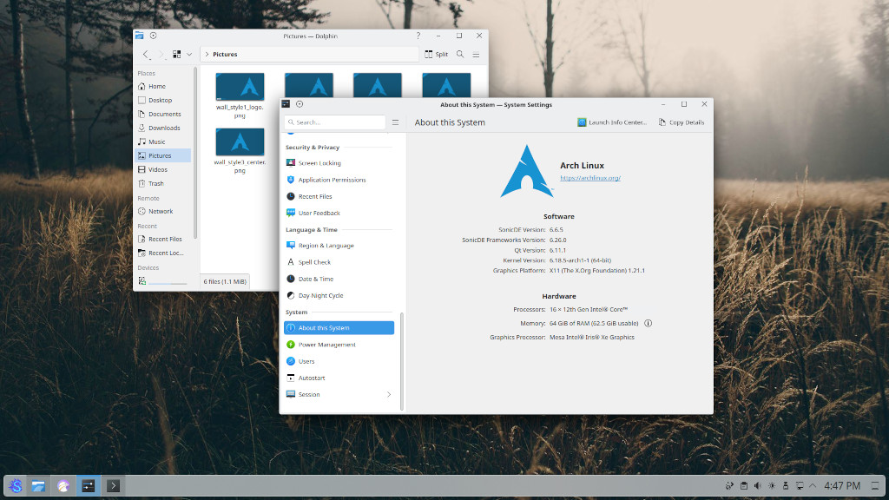

# SonicDE Packages for Arch Linux Systems

This third-party repository provides [SonicDE](https://sonicde.org) x86_64 binary  packages for [Arch Linux](https://archlinux.org)-based distributions. SonicDE, or the Sonic Desktop Environment, aims to preserve and improve the X11-specific aspects of KDE. You can learn more about SonicDE at [sonicde.org](https://sonicde.org/).

The packages of this repository are known to work with [Arch Linux](https://archlinux.org) and [Garuda Linux](https://garudalinux.org). We'll also verify the functionality on [ArchCraft](https://archcraft.io), [CachyOS](https://cachyos.org), [EndeavourOS](https://endeavouros.com), the testing branch of [Manjaro Linux](https://manjaro.org), and [RebornOS](https://rebornos.org).

## Installing SonicDE Manually

### Adding the Public Package Signing Key to pacman

First, please download the public OpenPGP signing key [`sonicde-archlinux.asc`](https://sonicde-arch.github.io/sonicde-archlinux.asc) used to sign the packages and add it to the pacman keyring:

```shell
curl -O https://sonicde-arch.github.io/sonicde-archlinux.asc
sudo pacman-key --add sonicde-archlinux.asc
sudo pacman-key --finger 3B87898C73F11DF5
sudo pacman-key --lsign-key 3B87898C73F11DF5
```
You can read more package signing on the [pacman/Package signing - ArchWiki](https://wiki.archlinux.org/title/Pacman/Package_signing#Adding_unofficial_keys) page.

### Adding the Repository to Pacman

Once you added the public key, also add an entry for the SonicDE repository to the end of the file [`/etc/pacman.conf`](https://man.archlinux.org/man/pacman.conf.5) using [`sudo`](https://wiki.archlinux.org/title/Sudo) and your favorite editor:

```ini
[sonicde]
Server = https://sonicde-arch.github.io/$arch
```

Run `pacman` to update all package indexes and installed packages:

```shell
sudo pacman -Syyu
```

### Installing SonicDE

Installing SonicDE is as easy as installing the `sonicde-meta` package:

```shell
sudo pacman -S sonicde-meta
```

The included packages will replace any of their installed KDE counterparts. When asked, just answer with `y `. To make use of SonicDE, log out of your desktop session and log in again.

In case you get kicked out of a running KDE session while you're installing SonicDE, just re-run `pacman` after you logged in again and let it install the missing packages:

```shell
sudo pacman -S sonicde-meta
```

When done, start the program `System Settings` and verify that you're running SonicDE on the "About this System" page. You do? Congratulations!

## Getting in Contact

Please report any enhancement requests or issues with this repository at [Issues · sonicde-arch/sonicde-arch](https://github.com/sonicde-arch/sonicde-arch/issues). If you have a specific issue, please see the [list of package repositories](https://github.com/orgs/sonicde-arch/repositories?q=topic%3Apackage) and report it there. In case you need help, want to report success or talk about other aspects, please also check the official SonicDE channels.

&nbsp;[Bluesky](https://bsky.app/profile/sonicdesktop.bsky.social)&nbsp; &nbsp;[Discord](https://discord.gg/cNZMQ62u5S) &nbsp; &nbsp;[Mastodon](https://mastodon.social/@sonicdesktop) &nbsp; &nbsp;[Matrix](https://matrix.to/#/#sonicdesktop:matrix.org) &nbsp; &nbsp;[OFTC IRC](https://webchat.oftc.net/?channels=sonicde%2Csonicde-devel%2Csonicde-dist&uio=MT11bmRlZmluZWQb1) &nbsp; &nbsp;[Telegram](https://t.me/sonic_de) &nbsp; &nbsp;[X (Twitter)](https://x.com/SonicDesktop)

